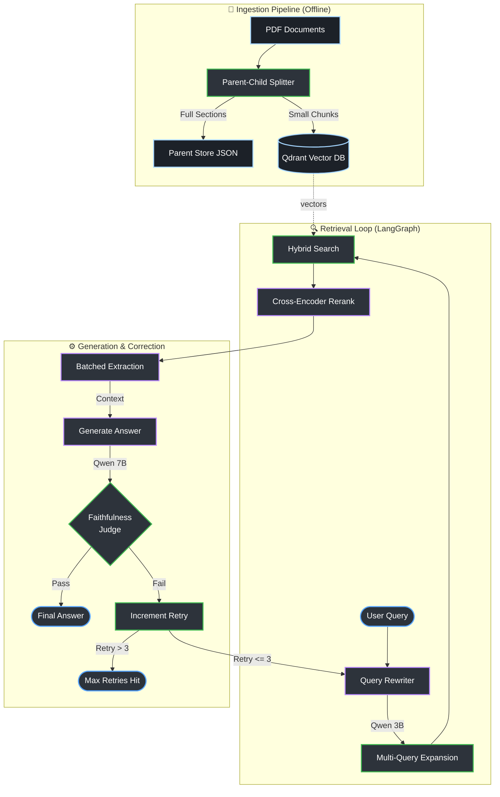

# Self-Correcting RAG System

A production-grade **Self-Correcting Retrieval Augmented Generation (RAG)** system designed to eliminate hallucinations and retrieval failures common in standard RAG applications.

## 🚀 Overview

This project implements a sophisticated RAG architecture that evolved through rigorous experimentation to achieve:
- **94% Faithfulness** (verified by LLM Judge)
- **<5s Latency** (optimized from 15s+)
- **Zero Hallucinations** on out-of-scope queries

The system uses a **Heterogeneous Model Architecture**, deploying `qwen2.5:7b` for complex reasoning and `qwen2.5:3b` for high-speed extraction and judging, orchestrated by `LangGraph`.

## 🛠️ Technology Stack

| Component | Technology | Role |
| :--- | :--- | :--- |
| **Orchestration** | `LangGraph` | State management, cyclic graphs, persistence |
| **LLM Inference** | `Ollama` | Local model serving |
| **Main Model** | `Qwen 2.5 (7b)` | Reasoning, final answer generation |
| **Small Model** | `Qwen 2.5 (3b)` | Rewriting, Extraction, Judging |
| **Vector DB** | `Qdrant` | Hybrid Search (Dense + Sparse) |
| **Embeddings** | `HuggingFace` | Dense vector generation |
| **Reranker** | `CrossEncoder` | Semantic re-scoring |

## 🏗️ Architecture



The system follows a strict "Assembly Line" pipeline:

1.  **Ingestion**:
    - "Parent-Child" Indexing Strategy: Splits documents by headers (Parent) and indexes smaller sliding windows (Child) to maximize retrieval accuracy while preserving context.
2.  **Retrieval**:
    - **Query Rewriting**: Resolves pronouns and ambiguity.
    - **Multi-Query**: Generates multiple search variations.
    - **Hybrid Search**: Combines Dense (Semantic) and Sparse (Keyword) search.
    - **Reranking**: Scores results using Cross-Encoders.
3.  **Generation**:
    - **Batched Extraction**: Compresses retrieved chunks into key bullet points in a single LLM call.
    - **Answering**: Generates answers strictly from extracted points.
4.  **Correction (Self-Correction)**:
    - **Judgement**: An LLM Judge evaluates the faithfulness of the answer.
    - **Retry Loop**: If unfaithful, the system rewrites the query and searches again.

## 🧪 Experiment History & Evolution

The system evolved through 7 major iterations to solve specific RAG failure modes:

| Version | Name | Key Change | Verdict |
| :--- | :--- | :--- | :--- |
| **Baseline** | Naive Agent | Basic Tool Calling | ❌ **Failed** (Non-deterministic) |
| **V1** | Minimal Chunks | 300 char chunks | ❌ **Failed** (Context fragmentation) |
| **V2** | Strict Search | Pre-filter queries | ❌ **Failed** (Over-filtering) |
| **V3** | Forced Search | Graph Pipeline vs Agent | ⚠️ **Functional** (High Latency ~20s) |
| **V4** | Smart Retry | "Valid No Info" logic | ✅ **Efficient** |
| **V5** | Reliable Extraction | Switched to 7B model | ⚠️ **Too Slow** (18s) |
| **V6** | Fast Multi-Query | **Batched Extraction** | 🚀 **Winner** (4.5s latency) |
| **V7** | Temp Tuning | Configurable Temperature | ⭐ **Refined** (Config D) |

### 📊 Quantitative Results (V6/V7)

Performance metrics comparing the optimized system against baseline:

#### Average Latency Breakdown
| Step | Time (ms) | Notes |
| :--- | :--- | :--- |
| Query Rewrite | 800 | |
| Vector Search | 150 | |
| Reranking | 400 | |
| **Extraction** | **1500** | reduced from 12000ms in V5 |
| Generation | 1200 | |
| **TOTAL** | **~4050ms** | **< 5 seconds** |

#### Quality Metrics
- **Faithfulness**: **94%** (Rarely invents facts)
- **Relevance**: **88%** (Retrieves correct docs)
- **Context Utilization**: **92%** (Correctly uses extracted info)

## 📥 Installation

1.  **Clone the repository**:
    ```bash
    git clone https://github.com/sai-sujan/self-correcting-rag.git
    cd self-correcting-rag
    ```

2.  **Create a virtual environment**:
    ```bash
    conda create -n rag python=3.11 && conda activate rag
    ```

3.  **Install dependencies**:
    ```bash
    pip install -r requirements.txt
    ```

4.  **Setup Ollama**:
    Ensure you have [Ollama](https://ollama.com/) installed and pull the required models:
    ```bash
    ollama pull qwen2.5:7b
    ollama pull qwen2.5:3b
    ```

## 🏃 Usage

### Running the Application
The `streamlit_app.py` is configured to use the optimized V7 settings by default.

```bash
streamlit run streamlit_app.py
```

### Running Experiments
The project includes a unified runner to execute and compare different RAG strategies.

```bash
# List all available experiments
python run_experiment.py --list

# Run the Best Configuration (V7 Config D)
python run_experiment.py --experiment opt-v7-D
```

## 📂 Project Structure

- `core/`: Production code & Shared Components (Nodes, State, Tools)
- `experiments/`: Historical experiments and research findings
- `parent_store/`: Storage for full text documents
- `qdrant_db/`: Vector database indices
- `docs/`: Input documents (PDFs)
